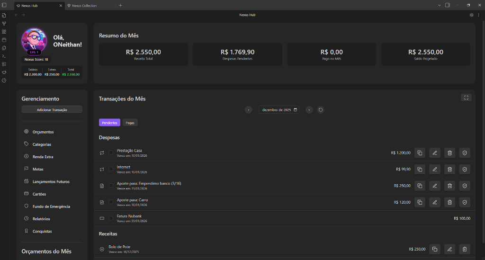
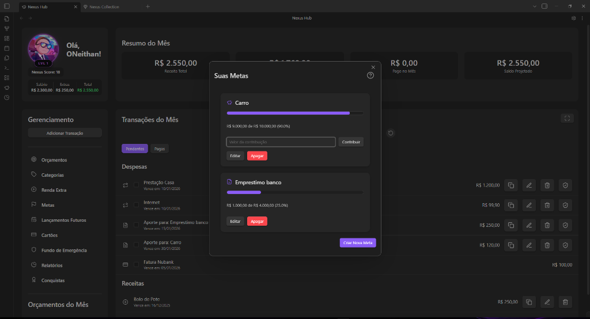
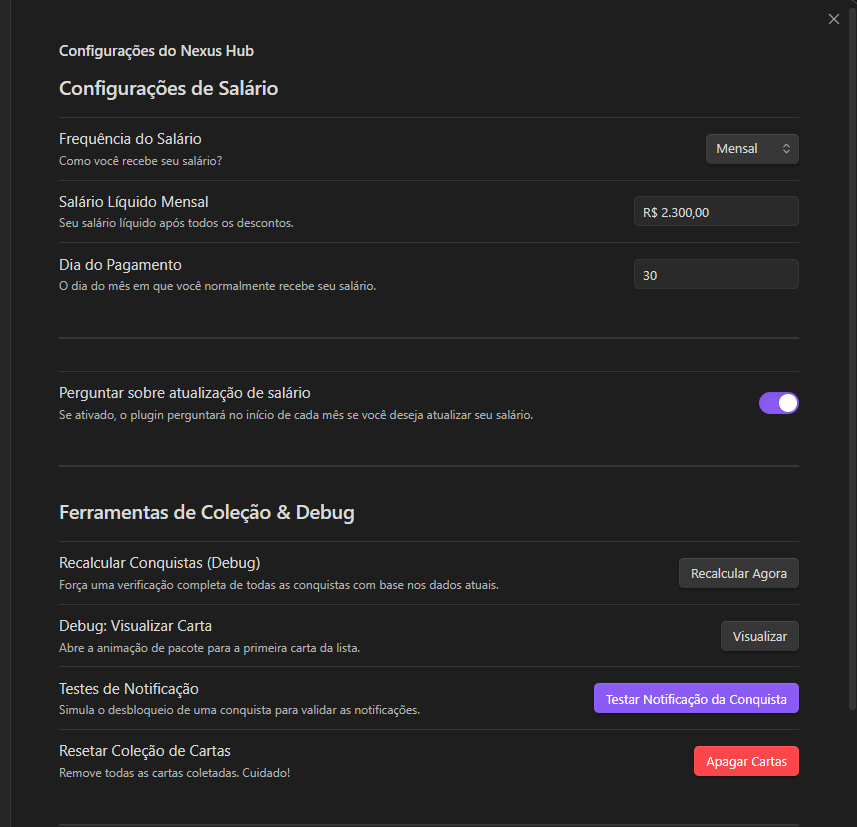
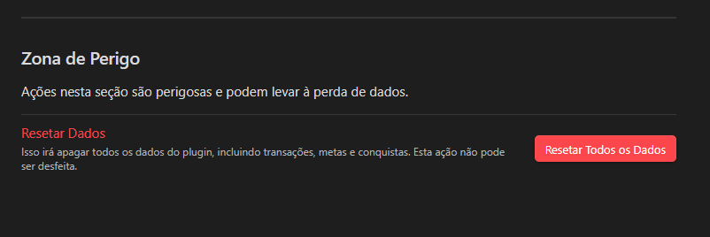
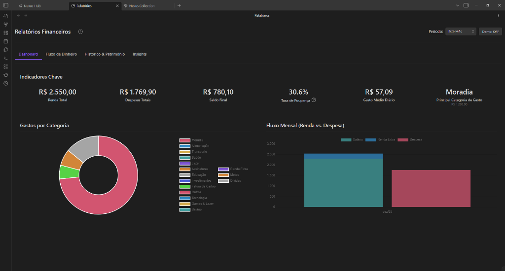
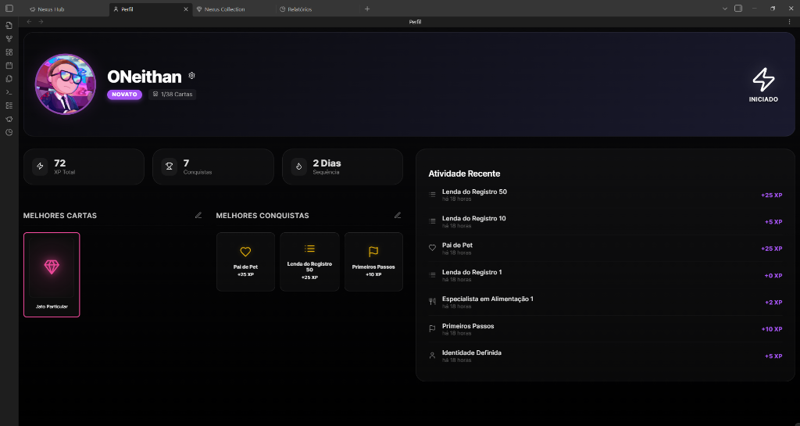
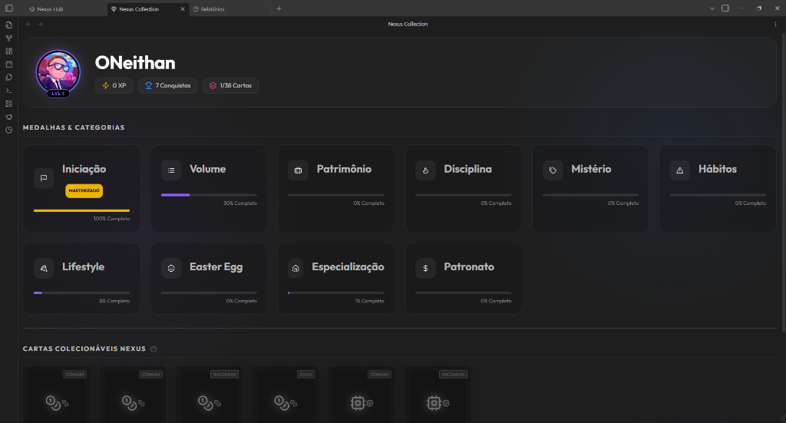
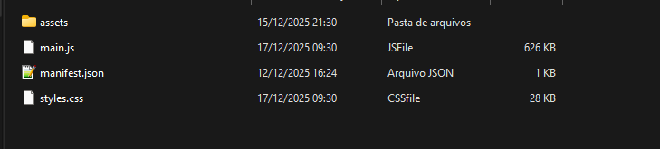
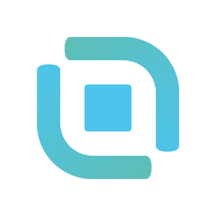
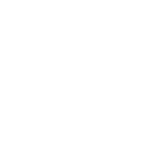

# 🌌 Nexus Hub

**Transforme sua gestão financeira em uma jornada épica no Obsidian.**

> ⚠️ **Avisos Importantes:**
> - **Exclusivo para Desktop:** Este plugin **NÃO** funciona em dispositivos móveis (Celular, Tablet, iPad) no momento. O suporte mobile está em desenvolvimento.
> - **Idioma:** O plugin está disponível apenas em **Português (PT-BR)**. O suporte para inglês será adicionado futuramente.

O **Nexus Hub** não é apenas um plugin de finanças; é um sistema completo de gestão de patrimônio gamificado. Ele transforma o ato de controlar despesas, receitas e investimentos em um RPG pessoal, onde cada centavo economizado te aproxima do próximo nível.

---

## ✨ Destaques & Funcionalidades

### 📊 Dashboard Financeiro (Futurista)

O coração do seu sistema. Visualize seu fluxo financeiro com um design limpo, moderno e responsivo.
- **Resumo do Mês:** Veja Receitas, Despesas Pendentes e Saldo Projetado em tempo real.
- **Gráficos Dinâmicos:** Fluxo de caixa mensal, distribuição por categoria e evolução patrimonial.
- **Modo Foco:** Expanda o dashboard para focar no que importa.
- **Navegação Temporal:** Viaje entre meses passados e futuros instantaneamente.

### 💰 Gestão de Transações (O Poder nas Mãos)
Registre tudo, de forma simples ou complexa.
- **Receitas:** Salários, freelas e dividendos.
- **Despesas Spot:** Aquele café ou compra rápida.
- **Parcelamentos Inteligentes:** Sim, o pesadelo de parcelar compras no cartão. O Nexus Hub gerencia parcelas automaticamente ("1/12", "2/12"...).
- **Recorrência Poderosa:**
    - Cadastre uma conta (ex: Netflix, Aluguel) **uma vez** e ela aparecerá todos os meses automaticamente.
    - Defina frequência (Mensal) e fim (Opcional).

### 💳 Gestão de Cartões de Crédito
Pare de se perder nas faturas.
- **Múltiplos Cartões:** Crie cartões com limites e datas de fechamento/vencimento.
- **Controle de Fatura:** Veja quanto da fatura já está comprometido.
- **Pagar Fatura:** Ao pagar uma fatura, o sistema baixa todas as despesas vinculadas e gera uma transação consolidada na sua conta principal.

### 🎯 Metas & Objetivos (Quests Reais)

Transforme sonhos em barras de progresso.
- **Metas de Poupança:** "Viagem Japão", "PC Gamer". O sistema calcula quanto falta e sugere depósitos.
- **Controle de Dívidas:** "Quitar Financiamento". Acompanhe a redução do seu débito mês a mês.
- **Alocação Virtual:** O dinheiro das metas é separado visualmente do seu saldo "gastável", evitando a falsa sensação de riqueza.

### 🛡️ Fundo de Emergência (Seu Escudo)
- Módulo dedicado para montar sua reserva.
- Defina quanto quer juntar e quanto vai depositar por mês.
- **Resgate de Emergência:** Se o bicho pegar, use o botão de emergência para cobrir despesas críticas sem destruir seu orçamento.

### ⚙️ Configurações & Segurança
Defina suas preferências e mantenha seus dados seguros.

- **Salário e Frequência:** Configure quanto você ganha e se o recebimento é Mensal ou Quinzenal.
- **Zona de Perigo:**

    - Precisa recomeçar do zero? Use o botão "Resetar Todos os Dados" para limpar transações e conquistas, mantendo apenas as configurações vitais.

Acompanhe sua evolução com gráficos precisos de gastos por categoria, fluxo de caixa e evolução patrimonial.

### 🎮 Gamificação (Finanças RPG)

A parte mais divertida. Gerenciar dinheiro não precisa ser chato.
- **Nível & XP:** Ganhe experiência ao registrar transações, pagar contas em dia e bater metas. Suba de nível e ganhe títulos (de "Iniciado" a "Magnata").
- **Conquistas (Badges):** Medalhas desbloqueáveis por comportamentos saudáveis (e alguns segredos).
- **Nexus Trading Cards:** Um jogo de cartas colecionáveis completo dentro do seu financeiro.
    
    - **Drop System:** Ao usar o plugin, você tem chance de "dropar" cartas de diferentes raridades (Comum, Rara, Épica, Lendária).
    - **Sistema de Raridade:** Cartas Lendárias são extremamente difíceis de conseguir.
    - **Séries Temáticas:** Colecione séries como "Cyberpunk", "Medieval", "Crypto" e "Space Odyssey".
    - **Efeitos Visuais:** Cartas com efeitos holográficos (foil) e 3D.
- **Easter Eggs:** O sistema esconde segredos em valores específicos, horários e descrições... consegue achar todos?

### 🔮 Lançamentos Futuros (Previsão)
- Veja o impacto das suas decisões daqui a 3, 6 ou 12 meses.
- O sistema projeta seu saldo futuro considerando todas as rendas e gastos recorrentes.

---

## 🚀 Instalação

### Via Community Plugins (Em Breve)
1. Abra o Obsidian.
2. Vá em `Settings > Community Plugins > Browse`.
3. Procure por `Nexus Hub`.
4. Clique em Install e depois Enable.

### Instalação Manual (Recomendada)
Para garantir que todos os sons e efeitos funcionem corretamente, siga estes passos:

1. Vá na aba **Releases** aqui no GitHub e baixe o arquivo `.zip` (ex: `nexus-hub-1.0.0.zip`).
2. No seu cofre do Obsidian, vá até a pasta `.obsidian/plugins/`.
    * *Dica:* Se a pasta `.obsidian` estiver oculta, habilite "Mostrar arquivos ocultos" no seu sistema.
3. Crie uma nova pasta chamada `nexus-hub`.
4. Extraia **todo o conteúdo do ZIP** dentro dessa pasta.
5. **Verifique:** A pasta deve ficar exatamente assim (com a pasta `assets` junto):
   
   

6. Recarregue o Obsidian e ative o plugin em *Community Plugins*.

---

## 🛠️ Como Usar (Guia Rápido)

### 1. Configuração Inicial (Setup)
Ao abrir pela primeira vez, vá na aba **Settings** do plugin (engrenagem).
- **Salário:** Defina sua renda mensal e dia de pagamento.
- **Perfil:** Escolha seu Nome de Usuário e personalize seu avatar.

### 2. Registrando Transações
Clique em **"Adicionar Transação"** no dashboard.
- Digite o valor e descrição.
- Escolha a categoria (O sistema aprende e sugere ícones/cores).
- **É Parcelado?** Marque "Parcelado" e coloque o número de vezes (ex: 12x).
- **É Recorrente?** Marque "Recorrente" se for uma conta fixa (ex: Internet).
- **É no Crédito?** Selecione o Cartão de Crédito criado anteriormente.

### 3. Subindo de Nível
- Apenas use o sistema. A consistência é a chave.
- Pagar contas antes do vencimento dá bônus.
- Juntar dinheiro no Fundo de Emergência dá XP extra.

### 4. Colecionando Cartas
- Não há um botão para "Ganhar Carta". Elas aparecem aleatoriamente quando você interage com o sistema (salva uma transação, completa uma meta, etc).
- Fique de olho nas notificações!

---

## 🌌 Filosofia do Projeto

O Nexus Hub nasceu da necessidade de tornar o controle financeiro menos "planilha de Excel" e mais "videogame". Acreditamos que o reforço positivo (níveis, cartas, visual bonito) é a melhor forma de criar o hábito de cuidar do dinheiro.

---

## ☕ Apoie o Desenvolvedor
Gostou do Nexus Hub? Considere apoiar o projeto! Isso ajuda a manter as atualizações constantes e novos recursos.

    
    

**Ou escaneie o QR Code:**

---

**Desenvolvido por ONeithan.**
*Mantenha seu saldo positivo e sua coleção completa.*